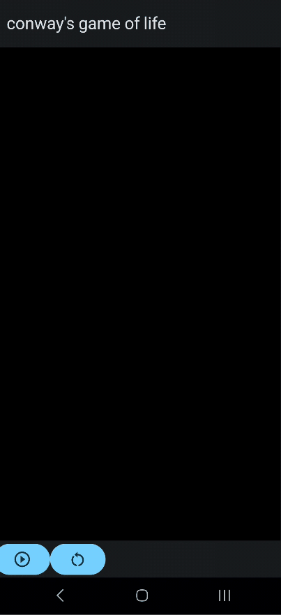

# Conway's Game of Life - Jetpack Compose

Este proyecto es una implementación del famoso **Juego de la Vida** de Conway, desarrollado en **Kotlin** usando **Jetpack Compose** para la interfaz gráfica.



## Descripción
El **Juego de la Vida** es un autómata celular donde cada célula en una cuadrícula vive o muere según reglas simples:
- Una célula viva con 2 o 3 vecinos sobrevive.
- Una célula muerta con exactamente 3 vecinos revive.
- En cualquier otro caso, la célula muere o sigue muerta.

Este proyecto permite visualizar y experimentar con esas reglas en tiempo real usando la potencia de **Jetpack Compose**.

## Cómo correrlo

1. Clona el repositorio:
    ```bash
    git clone https://github.com/ZapRender/Conway-s-game-of-life-in-jetpack-compose.git
    ```

2. Ábrelo en **Android Studio** (recomendado Arctic Fox o superior).

3. Ejecuta la app en un emulador o dispositivo físico.

## Tecnologías usadas

- **Kotlin**
- **Jetpack Compose**
- **State Hoisting** para manejo reactivo
- **Canvas API** para dibujar la cuadrícula
- **MVVM** (opcional si aplicas estructura)

## Contribuciones

¡Las contribuciones son bienvenidas! Si quieres agregar nuevas funciones (como zoom, cambio de velocidad o patrones predefinidos), no dudes en hacer un **fork** y enviar un **pull request**.

---

## Autor

### ¿Por qué elegí el Juego de la Vida?

Mientras estudiaba autómatas en la universidad, descubrí el Juego de la Vida de Conway y me fascinó su concepto como "el juego de cero jugadores". Eso despertó mi interés y me propuse el reto de implementarlo desde cero en diferentes tecnologías. Con la llegada de Jetpack Compose para Kotlin, vi la oportunidad perfecta para llevar esta simulación a Android aprovechando las nuevas herramientas modernas de UI.

Elegí implementar el **Juego de la Vida de Conway** porque combina perfectamente conceptos de:
- **Algoritmos** (reglas simples que generan comportamientos complejos)
- **Programación reactiva** con **Jetpack Compose**
- Uso del **Canvas API** para gráficos en tiempo real

Además, es un excelente ejemplo de cómo estructuras de datos y actualizaciones de estado pueden crear simulaciones dinámicas, lo que lo convierte en un proyecto ideal para practicar tanto lógica como UI en Android moderno.

Me permitió profundizar en temas como:
- Optimización del renderizado con Compose
- Manejo eficiente de listas bidimensionales en Kotlin
- Actualización de estados sin perder rendimiento


Hecho con Kotlin por [ZapRender](https://github.com/ZapRender).

